# Module 9 Tutorial B: Visualizing and Architectural Risk

This document summarizes the current microservice architecture of the JaStip Online Nasional (JSON) project and then expands it with proposed improvements and module-level analysis.

Working assumptions used in the diagrams:

- `group-preparation` is treated as the Tutorial B deliverable repository because it is the only documentation-only repository in the organization.
- `frontend` is treated as the active user interface because its README explicitly states it is the real Milestone 75 frontend. Service-local `frontend/` folders inside `Order`, `Wallet`, and `Voucher-Promo` are treated as legacy or service-scoped assets rather than separate production containers.
- The deployment view reflects the Cloud Run commands and runtime defaults documented in each service README. Where multiple database profiles exist, the currently documented demo profile is treated as the current architecture.
- No message broker is wired into the current milestone implementation. Service-to-service integration is synchronous HTTP REST.

## Current Architecture

### System Context Diagram

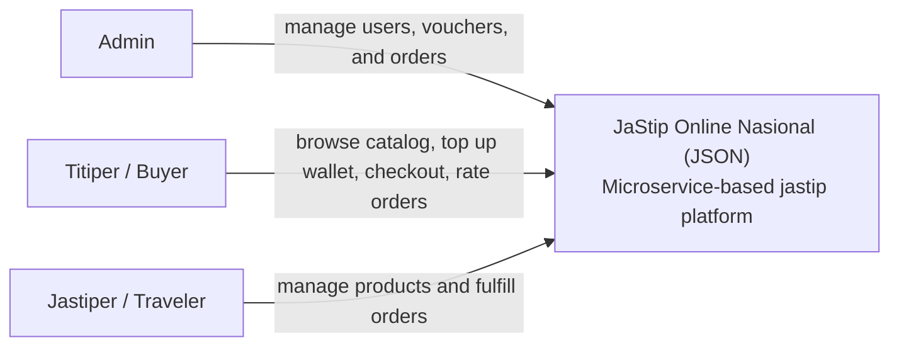

Short explanation:
The current system serves three user roles from the project brief: Admin, Titiper, and Jastiper. At this level, the system behaves as one business platform that handles authentication, catalog browsing, wallet transactions, order checkout, and voucher usage.

### Container Diagram

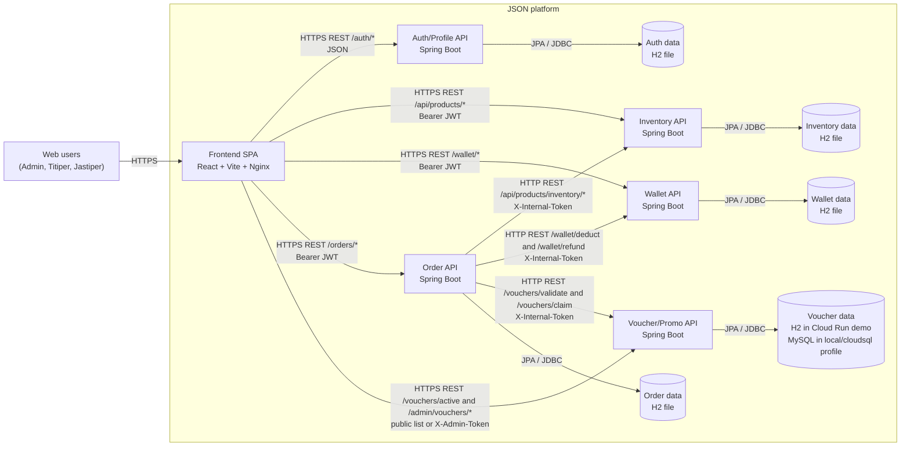

Short explanation:
The platform currently has one browser-based frontend container and five backend API containers: Auth/Profile, Inventory, Wallet, Order, and Voucher/Promo. The frontend calls each API directly over REST. The Order service acts as the checkout orchestrator and synchronously calls Inventory, Wallet, and Voucher/Promo with `X-Internal-Token` headers. Each service owns its own persistence, which follows the microservice data isolation principle even though most current demo deployments still use embedded H2 storage.

### Deployment Diagram

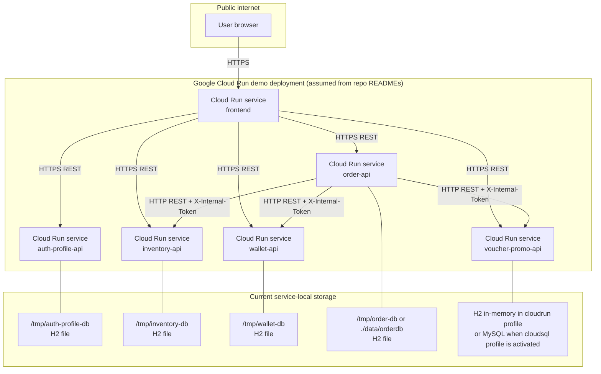

Short explanation:
The current deployment is best understood as a set of independently deployed Cloud Run services, one per repository, plus one public frontend service. This view is an explicit assumption based on the deploy commands documented in the READMEs. The important current characteristic is that the runtime remains fragile: most services keep state in H2 files or in-memory storage attached to the service runtime instead of durable managed databases, and public traffic reaches backend services directly rather than through a single API gateway.

## Future Architecture

### Future Container Diagram

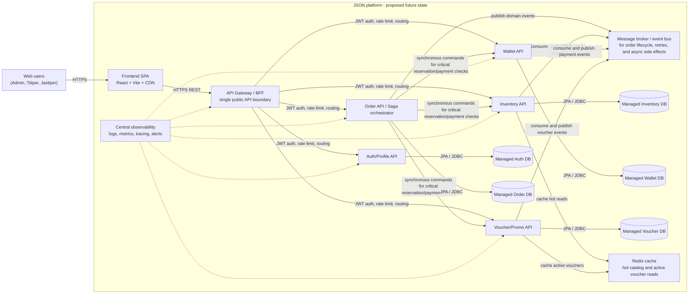

### Future Deployment Diagram

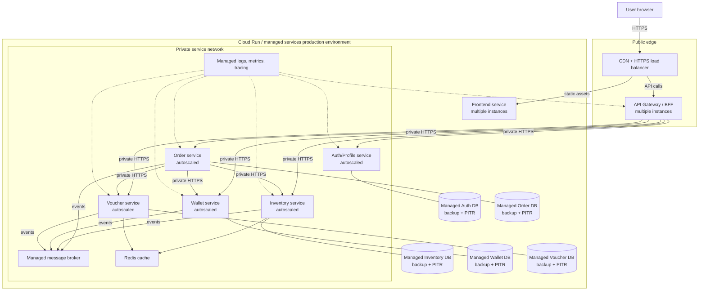

### Architectural Improvements

The future architecture addresses the main weaknesses of the current implementation:

- A single API Gateway or BFF becomes the only public API boundary, so browsers no longer call every backend directly.
- Each service moves from embedded H2 or in-memory runtime storage to a managed database with backup and point-in-time recovery.
- The checkout path remains synchronous only where immediate consistency is necessary, while non-critical side effects move to an event bus to reduce coupling and improve recovery behavior.
- Observability becomes a first-class architecture concern through centralized logs, metrics, tracing, and alerting.
- Hot reads such as active vouchers and frequently viewed catalog items can be cached to reduce repetitive database pressure during flash-sale or war traffic.
- Private service-to-service networking reduces exposure of internal APIs and makes token management easier to control.

### Trade-offs

- Introducing an API gateway and message broker adds operational complexity and deployment cost.
- Saga-style coordination and asynchronous events improve resilience, but they also increase consistency design work and debugging difficulty.
- Managed databases and Redis improve durability and scale, but they require schema migration discipline, backup operations, and capacity management.
- Centralized observability and secret management improve supportability and security, but they add platform dependencies that the team must maintain.

## Risk Storming Explanation

Risk storming is a structured architecture review technique used to identify risks by looking at a system from several quality perspectives such as availability, scalability, security, operability, and maintainability. Instead of discussing architecture only from a feature perspective, the team evaluates what could fail if the project becomes successful and receives much higher traffic than the milestone demo.

We applied risk storming to this project because the current repositories already show several production-sensitive decisions:

- every business capability is split into separate services,
- checkout depends on multiple synchronous downstream calls,
- the current demo deployment still relies heavily on embedded H2 storage,
- frontend traffic reaches backend services directly,
- there is no dedicated observability or integration backbone.

### Risk Matrix

| Risk Area | Impact | Likelihood | Score | Level | Explanation | Mitigation |
|---|---:|---:|---:|---|---|---|
| Data durability and recovery | 3 | 3 | 9 | High | Auth, Inventory, Wallet, and Order default to service-local H2 storage, while Voucher uses H2 in the documented Cloud Run profile. Instance loss or bad rollout can lose state or make recovery difficult. | Move every service to managed databases with backup, recovery, and migration discipline. |
| Checkout path availability | 3 | 3 | 9 | High | `Order` synchronously calls `Inventory`, `Wallet`, and `Voucher/Promo`. A slow or failing downstream service can block checkout entirely. | Keep only critical synchronous checks, add retries/timeouts/circuit breakers, and publish non-critical follow-up work through a broker. |
| Edge security and trust boundary | 3 | 2 | 6 | High | The frontend directly calls multiple public backend URLs. JWT verification is distributed through shared secrets, and Voucher admin/internal access depends on header tokens and custom filters. | Add an API gateway, private service networking, centralized secret management, and stricter token validation boundaries. |
| Scalability during war traffic | 3 | 2 | 6 | High | Flash-sale behavior concentrates load on Order, Inventory, Wallet, and Voucher quota checks. Active voucher reads and stock checks can spike at the same time. | Add autoscaling, cache hot reads, and use event-driven buffering for asynchronous work. |
| Observability and incident response | 2 | 3 | 6 | High | No repository documents centralized tracing, correlation IDs, or cross-service alerting. Failures across multiple services will be hard to diagnose quickly. | Add centralized logs, metrics, tracing, dashboards, and alert rules. |
| Deployment and configuration fragility | 2 | 2 | 4 | Medium | The repos rely on per-service environment variables and independent deploy commands. Token drift, CORS drift, or base URL mismatch can break the system even when each service still works individually. | Standardize deployment templates, secret storage, configuration contracts, and release checks. |

Scoring used:

- Impact: `1` low, `2` medium, `3` high
- Likelihood: `1` low, `2` medium, `3` high
- Score = `Impact x Likelihood`
- Level mapping: `1-2` low, `3-4` medium, `6-9` high

### Identified Risks in the Current Architecture

The current architecture is already functionally split by bounded context, but it still behaves like a tightly coupled demo environment in several important ways:

- data durability depends on per-service local storage instead of managed persistence,
- order checkout has no isolation from downstream service outages,
- public traffic reaches backend services directly instead of passing through a unified edge layer,
- security and operational behavior are configured separately in each repo,
- war-style traffic would stress the exact services that already sit in the critical checkout path.

### Consensus Result

The group consensus is that the highest-priority risks are:

1. data loss or inconsistent recovery after deployment/runtime failure,
2. checkout unavailability caused by the synchronous dependency chain,
3. weak edge control caused by direct frontend-to-service traffic,
4. poor diagnosability when failures span several services.

These were treated as the key risks because they directly affect user trust, transaction success, and the team's ability to operate the system once traffic grows.

### Mitigation Strategy

The proposed mitigation strategy is:

- keep microservice boundaries, but strengthen the public edge with an API gateway,
- replace embedded demo persistence with managed service-owned databases,
- add event-driven communication for asynchronous and compensating work,
- introduce centralized observability and alerting,
- put internal traffic on private networking and manage secrets centrally,
- add cache support for read-heavy paths such as active vouchers and popular catalog items.

### How the Mitigations Influenced the Future Architecture

The future architecture section is a direct consequence of the risk storming discussion:

- the API gateway exists because the current public surface is too fragmented,
- the event bus exists because the current checkout path is too tightly coupled,
- managed databases and backup strategy exist because service-local H2 storage is too fragile,
- Redis is introduced because war traffic will repeatedly hit the same catalog and voucher reads,
- observability is elevated into its own platform concern because the current repositories do not provide cross-service visibility by default.

## Individual Architecture Work

My individual responsibility: **Voucher Promo**

### Component Diagram

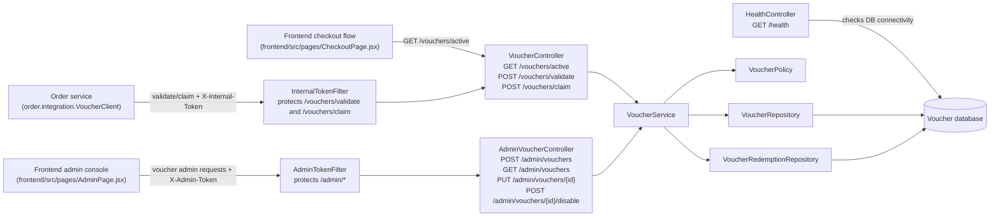

This component diagram expands the **Voucher/Promo API** container from the group container diagram. In the group view, Voucher/Promo appears as one backend service. In this zoomed-in view, that service is decomposed into public/admin controllers, security filters, application service logic, policy validation logic, repositories, and the persistence layer that stores voucher definitions and voucher claims.

### Code Diagram 1 - Main Class and Module Relationships

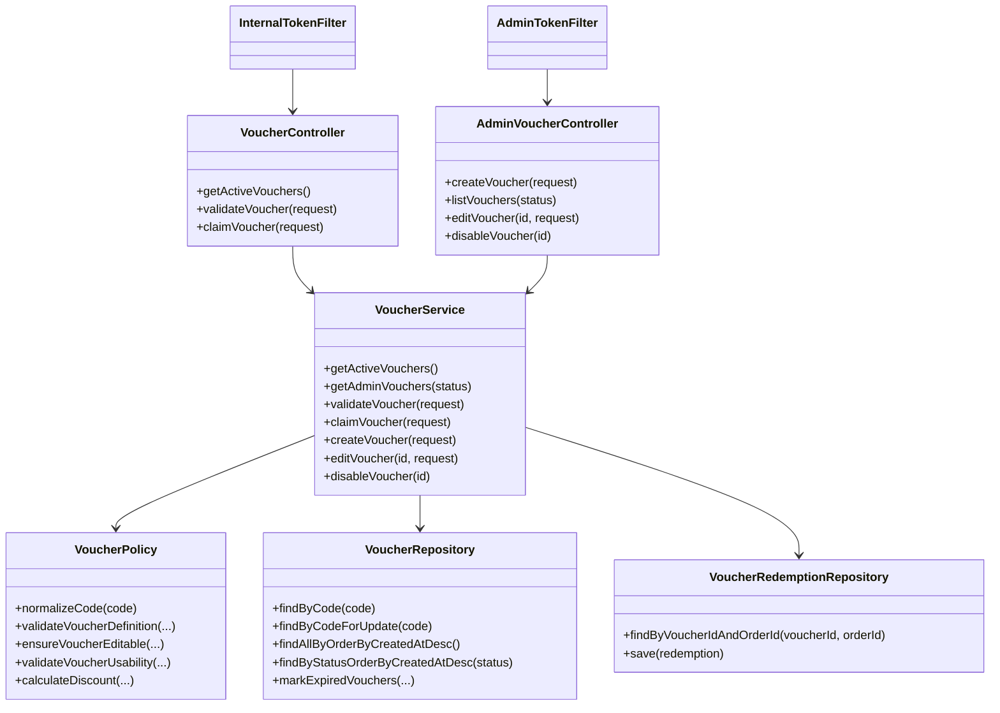

### Code Diagram 2 - Voucher Persistence Model

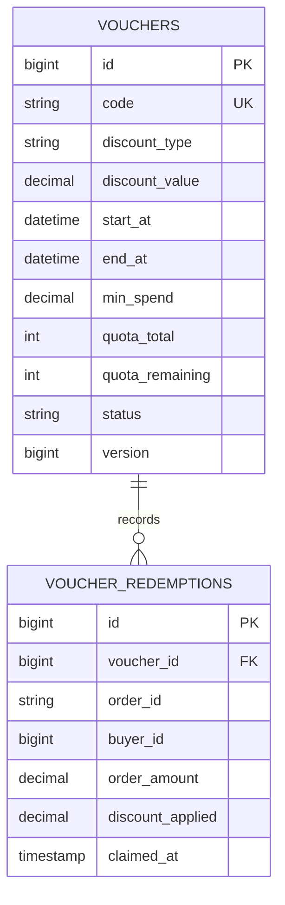

### Code Diagram 3 - Voucher Claim Flow

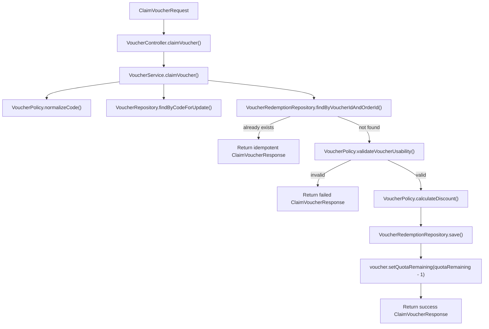

### Code Diagram 4 - Security-Relevant Entry Paths

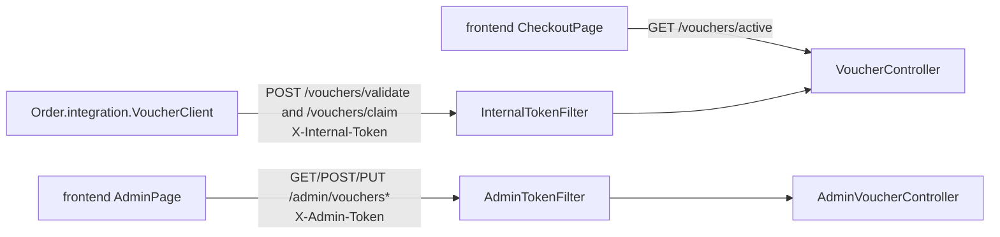

These code diagrams map directly to the Voucher Promo source code:

- `VoucherController`, `AdminVoucherController`, `VoucherService`, `VoucherPolicy`, `VoucherRepository`, and `VoucherRedemptionRepository` are defined under `Voucher-Promo/backend/src/main/java/com/example/demo/voucher/...`
- `InternalTokenFilter` and `AdminTokenFilter` are defined under `Voucher-Promo/backend/src/main/java/com/example/demo/security/...`
- the `Voucher` and `VoucherRedemption` tables come from the JPA entities and Flyway migrations in `Voucher-Promo/backend/src/main/resources/db/migration/...`
- the external admin and checkout callers shown in the diagrams map to `frontend/src/pages/AdminPage.jsx`, `frontend/src/pages/CheckoutPage.jsx`, and `Order/backend/src/main/java/id/ac/ui/cs/advprog/order/integration/VoucherClient.java`

Together, these diagrams show that my individual work is centered on voucher validation, voucher claiming, quota protection, admin voucher lifecycle management, and the persistence rules needed to keep voucher usage correct under repeated or concurrent checkout requests.

### Bonus Additional Module View - Inventory

The following bonus diagrams expand the Inventory service as an additional architecture view. This module is a useful bonus subject because it sits directly on the checkout path and it already contains explicit stock-protection logic for war-like purchase contention.

#### Inventory Component Diagram

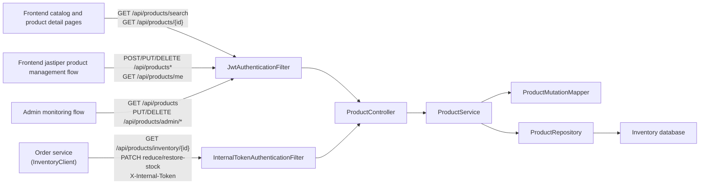

This bonus component diagram expands the **Inventory API** container from the group-level container diagram. The important architectural point is that Inventory is not only a catalog CRUD service. It also acts as a guarded stock authority for checkout, with one access path for browser traffic and another path for internal service-to-service stock mutation requested by `Order`.

#### Inventory Code Diagram 1 - Main Class Relationships

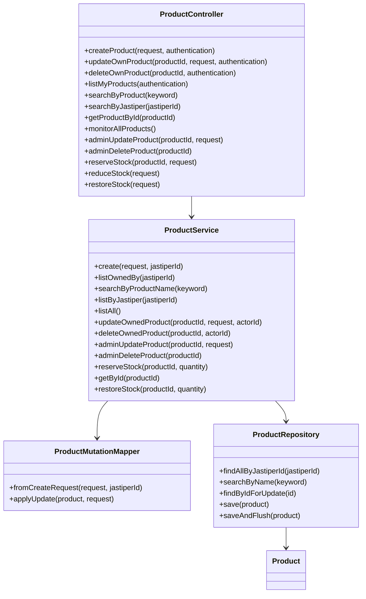

#### Inventory Code Diagram 2 - Stock Reservation and War-Protection Flow

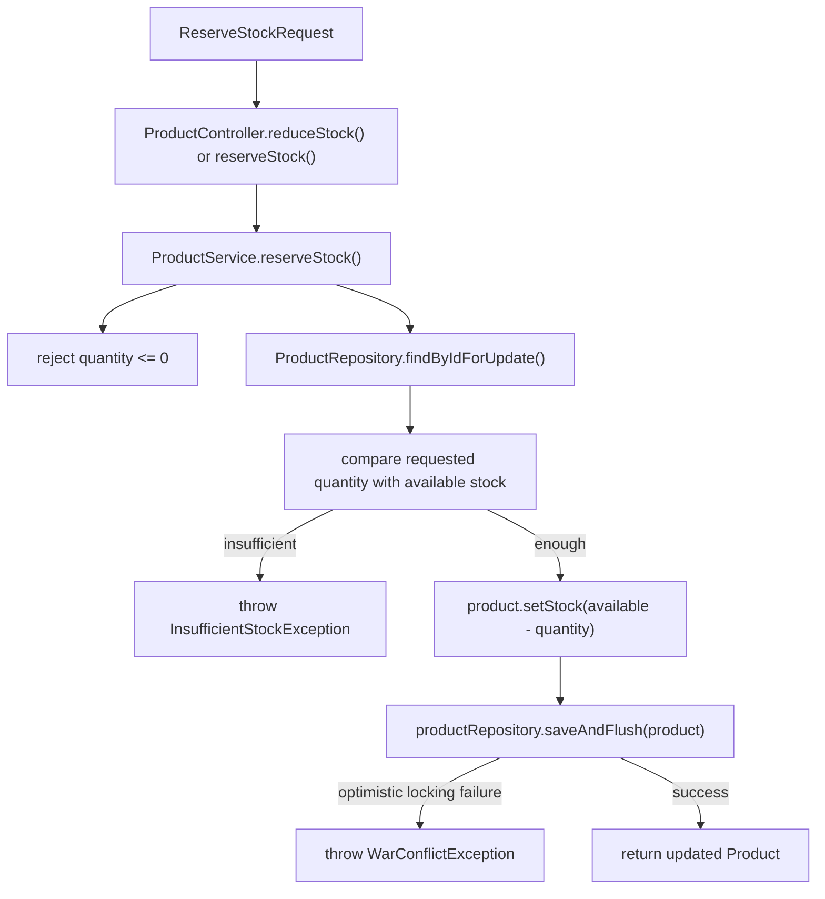

These Inventory code diagrams map directly to the current source files:

- `Inventory/src/main/java/id/ac/ui/cs/advprog/inventory/controller/ProductController.java`
- `Inventory/src/main/java/id/ac/ui/cs/advprog/inventory/service/ProductService.java`
- `Inventory/src/main/java/id/ac/ui/cs/advprog/inventory/service/ProductMutationMapper.java`
- `Inventory/src/main/java/id/ac/ui/cs/advprog/inventory/repository/ProductRepository.java`
- `Inventory/src/main/java/id/ac/ui/cs/advprog/inventory/model/Product.java`

Architecturally, this bonus expansion is valuable for four reasons:

1. It shows the exact place where overselling protection is implemented: `findByIdForUpdate()` combined with guarded stock mutation inside `reserveStock()`.
2. It makes the security split visible: browser-originated requests enter through JWT-based role checks, while checkout-originated requests enter through the internal-token path.
3. It shows that Inventory owns both product metadata and stock consistency, so it is a business-critical state holder rather than a passive data service.
4. It exposes the current consistency trade-off clearly: stock mutation is still synchronous in the request path, which is straightforward for correctness but keeps Inventory on the critical latency path for each checkout.

#### Inventory Architectural Interpretation

From an architecture-review perspective, the Inventory module reinforces several conclusions from the risk storming section:

- **Availability sensitivity:** if Inventory becomes unavailable, both catalog browsing and checkout stock reservation degrade immediately.
- **Scalability sensitivity:** war traffic can produce concentrated lock contention around a small number of hot products.
- **Coupling sensitivity:** `Order` depends on Inventory synchronously for product snapshots and stock mutation, so Inventory failures propagate into checkout failures.
- **Data integrity sensitivity:** the service contains the main business rule that prevents negative stock, making it one of the core correctness boundaries in the current system.

For that reason, Inventory is not only a supporting module. In the present architecture it behaves as one of the core reliability boundaries of the whole platform.

## Individual Architecture Work
 
My individual responsibility: **Order**
 
### Component Diagram
 
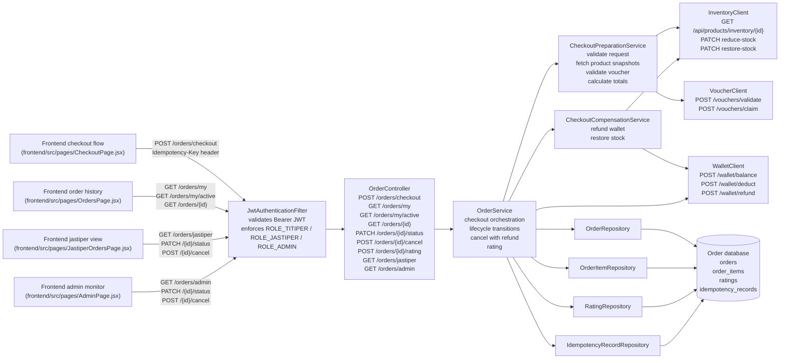
 
This component diagram expands the **Order API** container from the group container diagram. The Order service acts as the checkout orchestrator for the whole platform. It is responsible for coordinating product snapshot reads from Inventory, wallet balance checks and deductions from Wallet, voucher validation and quota claims from Voucher/Promo, and persisting the resulting order and its line items. It is the only service in the system that calls three other services in a single request path.
 
The service also manages the full order lifecycle after checkout: status transitions driven by jastiper and buyer roles, cancel with automatic wallet refund and stock restoration, and buyer rating submission after order completion. An `IdempotencyRecordRepository` is wired into the checkout path to prevent duplicate orders on network retry or accidental double-submit from the frontend.

### Code Diagram 1 — Main Class and Module Relationships
 
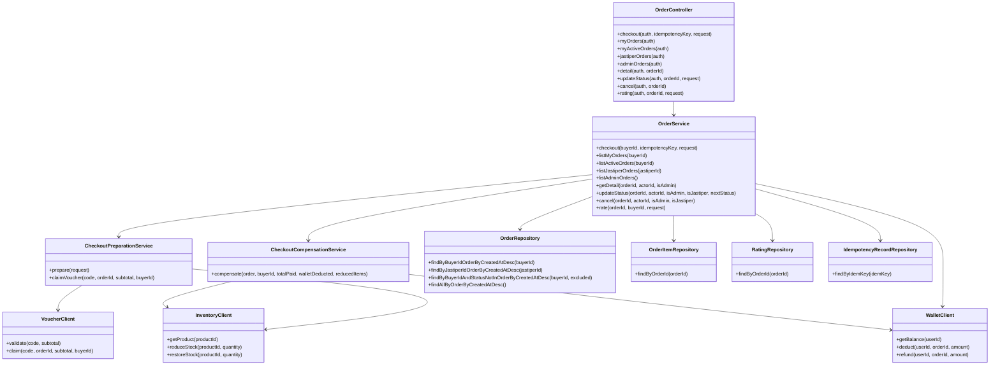
### Code Diagram 2 — Order Persistence Model
 
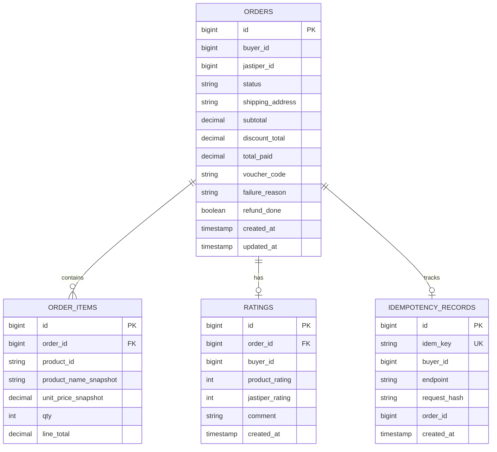
### Code Diagram 3 — Checkout Flow with Idempotency
 
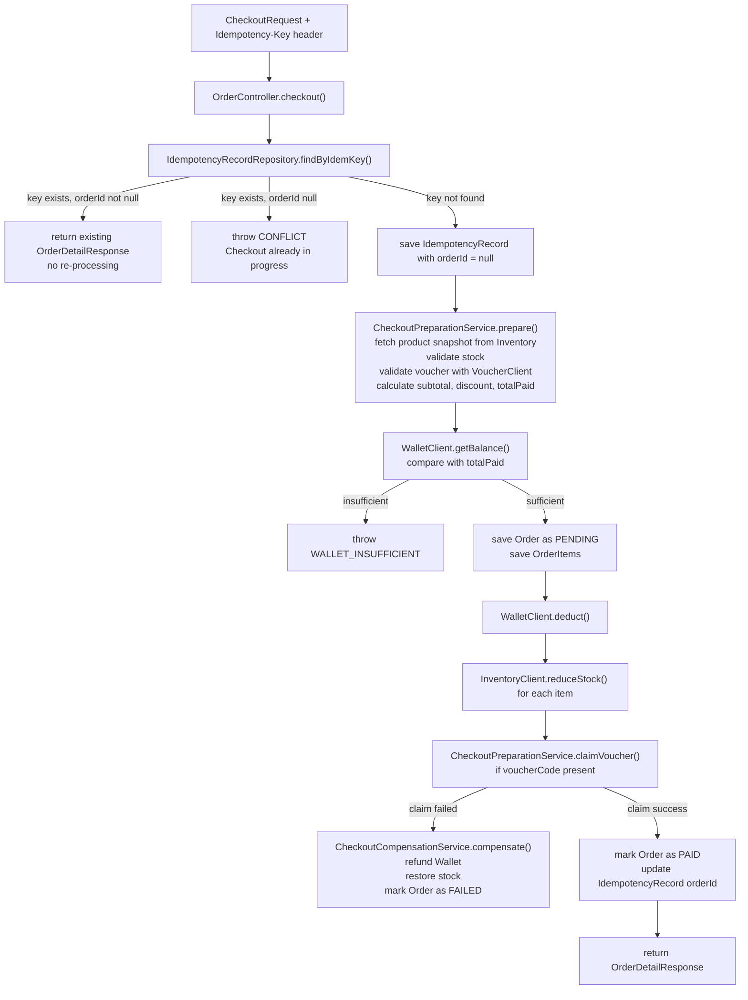

### Code Diagram 4 — Order Lifecycle State Machine

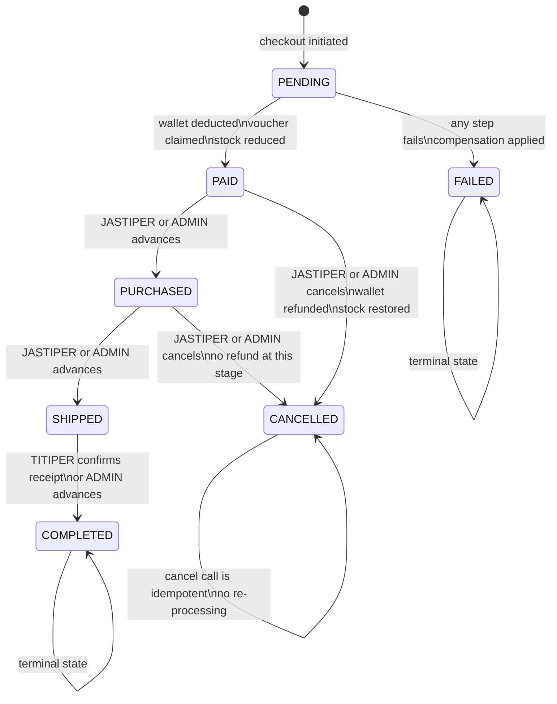
### Code Diagram 5 — Role-Based Access per Endpoint

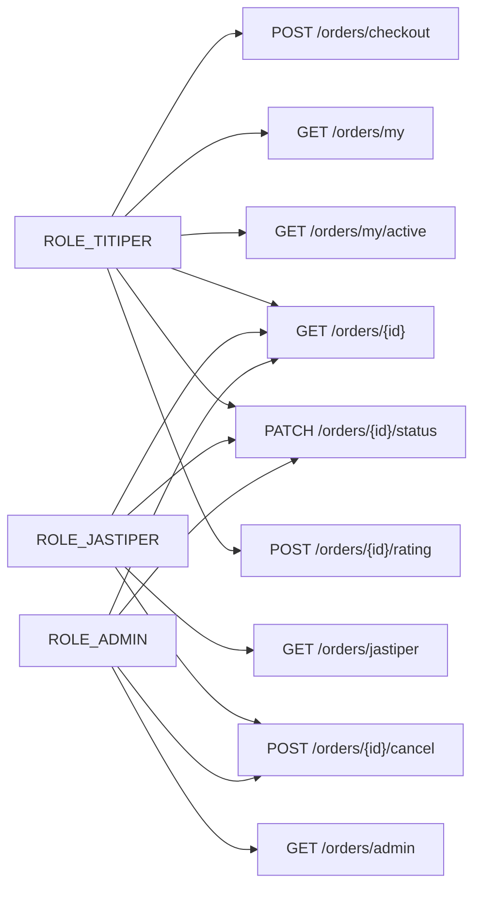

These code diagrams map directly to the Order service source files:

- `OrderController` is defined at `Order/backend/src/main/java/id/ac/ui/cs/advprog/order/controller/OrderController.java`
- `OrderService`, `CheckoutPreparationService`, and `CheckoutCompensationService` are at `Order/backend/src/main/java/id/ac/ui/cs/advprog/order/service/`
- `InventoryClient`, `WalletClient`, and `VoucherClient` are at `Order/backend/src/main/java/id/ac/ui/cs/advprog/order/integration/`
- `Order`, `OrderItem`, `Rating`, and `IdempotencyRecord` entities are at `Order/backend/src/main/java/id/ac/ui/cs/advprog/order/entity/`
- All four repositories are at `Order/backend/src/main/java/id/ac/ui/cs/advprog/order/repository/`
- The external callers shown in the component diagram map to `frontend/src/pages/CheckoutPage.jsx`, `frontend/src/pages/OrdersPage.jsx`, `frontend/src/pages/JastiperOrdersPage.jsx`, and `frontend/src/pages/AdminPage.jsx`

Together these diagrams show that my individual work is centered on checkout orchestration across three downstream services, full order lifecycle management, cancel with idempotent refund, dual-dimension buyer rating, and retry-safe checkout through an idempotency key mechanism.
