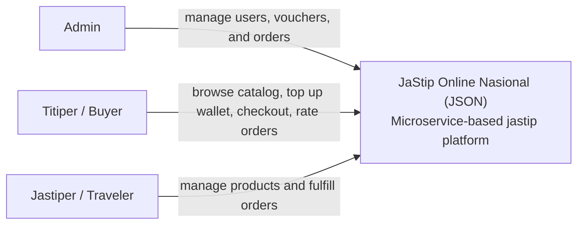
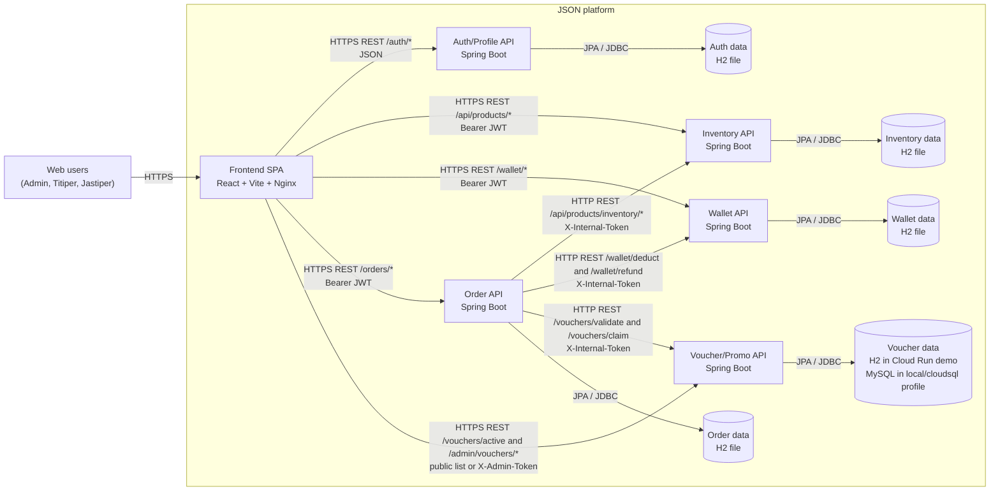
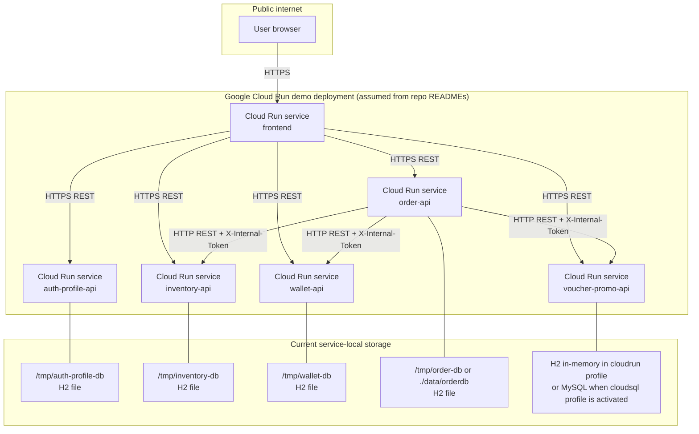
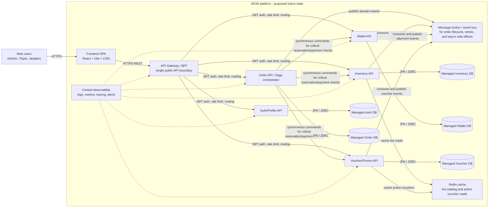
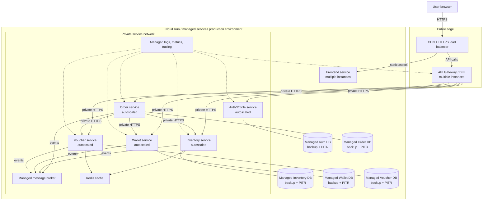

# Module 9 Tutorial B: Visualizing and Architectural Risk

This document summarizes the current microservice architecture of the JaStip Online Nasional (JSON) project and then expands it with proposed improvements and module-level analysis.

Working assumptions used in the diagrams:

- `group-preparation` is treated as the Tutorial B deliverable repository because it is the only documentation-only repository in the organization.
- `frontend` is treated as the active user interface because its README explicitly states it is the real Milestone 75 frontend. Service-local `frontend/` folders inside `Order`, `Wallet`, and `Voucher-Promo` are treated as legacy or service-scoped assets rather than separate production containers.
- The deployment view reflects the Cloud Run commands and runtime defaults documented in each service README. Where multiple database profiles exist, the currently documented demo profile is treated as the current architecture.
- No message broker is wired into the current milestone implementation. Service-to-service integration is synchronous HTTP REST.

## Current Architecture

### System Context Diagram

Short explanation:
The current system serves three user roles from the project brief: Admin, Titiper, and Jastiper. At this level, the system behaves as one business platform that handles authentication, catalog browsing, wallet transactions, order checkout, and voucher usage.

### Container Diagram

Short explanation:
The platform currently has one browser-based frontend container and five backend API containers: Auth/Profile, Inventory, Wallet, Order, and Voucher/Promo. The frontend calls each API directly over REST. The Order service acts as the checkout orchestrator and synchronously calls Inventory, Wallet, and Voucher/Promo with `X-Internal-Token` headers. Each service owns its own persistence, which follows the microservice data isolation principle even though most current demo deployments still use embedded H2 storage.

### Deployment Diagram

Short explanation:
The current deployment is best understood as a set of independently deployed Cloud Run services, one per repository, plus one public frontend service. This view is an explicit assumption based on the deploy commands documented in the READMEs. The important current characteristic is that the runtime remains fragile: most services keep state in H2 files or in-memory storage attached to the service runtime instead of durable managed databases, and public traffic reaches backend services directly rather than through a single API gateway.

## Future Architecture

### Future Container Diagram

### Future Deployment Diagram

### Architectural Improvements

The future architecture addresses the main weaknesses of the current implementation:

- A single API Gateway or BFF becomes the only public API boundary, so browsers no longer call every backend directly.
- Each service moves from embedded H2 or in-memory runtime storage to a managed database with backup and point-in-time recovery.
- The checkout path remains synchronous only where immediate consistency is necessary, while non-critical side effects move to an event bus to reduce coupling and improve recovery behavior.
- Observability becomes a first-class architecture concern through centralized logs, metrics, tracing, and alerting.
- Hot reads such as active vouchers and frequently viewed catalog items can be cached to reduce repetitive database pressure during flash-sale or war traffic.
- Private service-to-service networking reduces exposure of internal APIs and makes token management easier to control.

### Trade-offs

- Introducing an API gateway and message broker adds operational complexity and deployment cost.
- Saga-style coordination and asynchronous events improve resilience, but they also increase consistency design work and debugging difficulty.
- Managed databases and Redis improve durability and scale, but they require schema migration discipline, backup operations, and capacity management.
- Centralized observability and secret management improve supportability and security, but they add platform dependencies that the team must maintain.
